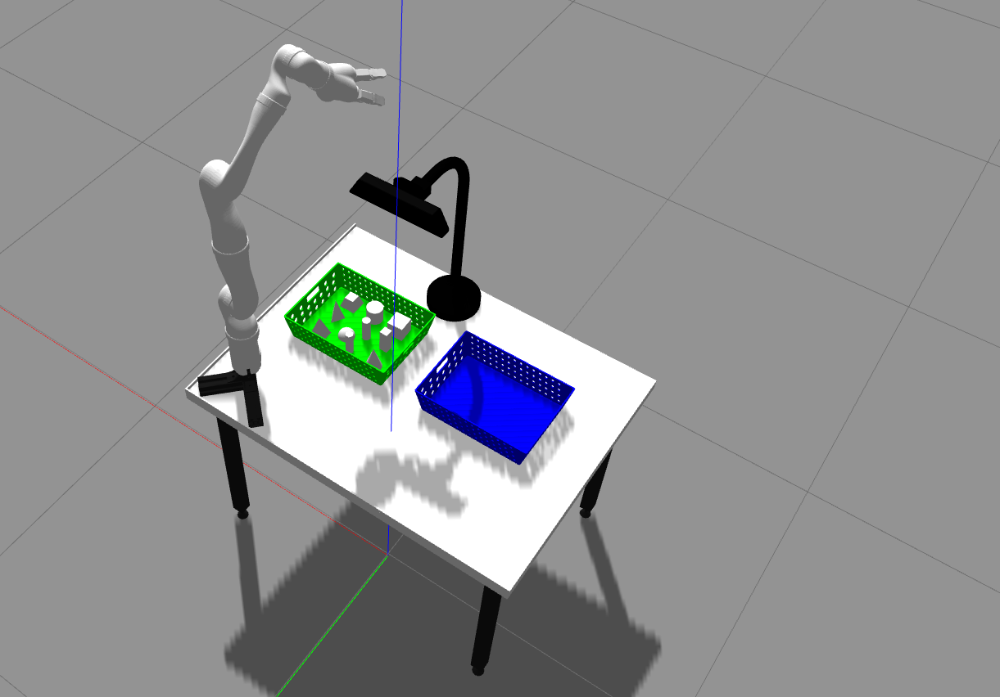
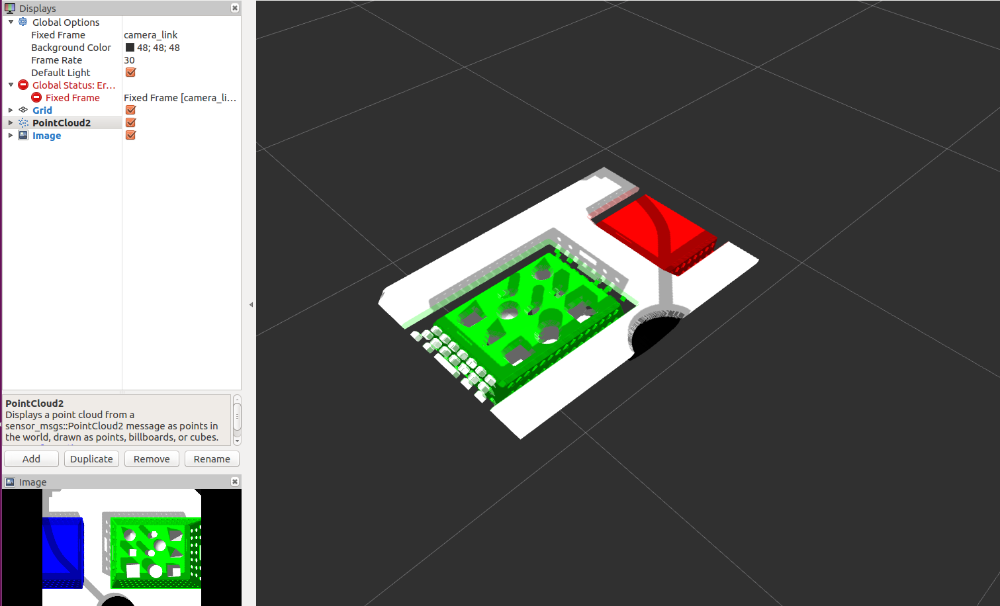

# robot_grasp
robot grasp task for JCAR competition held by Tsinghua Univ* and Siemes. The source will be open after competition.
## Introduction
This package contains grasp model.

## Run the demo by yourself
Tested on Ubuntu 16.04 (64 bits) and ROS version is Kinetic.  
Dependence: [kinova-ros](https://github.com/Kinovarobotics/kinova-ros)  
0> Compile
~~~
mkdir -p ~/catkin_ws/src
cd ~/catkin_ws/src
git clone https://github.com/Kinovarobotics/kinova-ros.git 
sudo apt-get install ros-kinetic-gazebo-ros* 
sudo apt-get install ros-kinetic-gazebo-ros-control
sudo apt-get install ros-kinetic-ros-controllers*
git clone https://github.com/marooncn/robot_grasp.git
cd ..
catkin_make
~~~
1> Load the grasp model  
~~~
source ~/catkin_ws/devel/setup.bash
rosrun robot_grasp load_model.launch
~~~
Then snap kinect to kinect_support with face down.
2> Load the grasp objects  
2.1 > Insert the grasp object one by one
~~~
cp -r ~/catkin_ws/src/robot_grasp/models/grasp_object/* ~/.gazebo/models/
~~~
Then you can insert the corresponding object under Gazebo 'Insert' toolbar.  
2.2> Insert the grasp by roslaunch
~~~
roslaunch robot_grasp load_object.launch
~~~

3> Tune the PID parameters
The robot model is controlled by PID. If the model is unstable, then you can change the PID parameters until it's stable.
~~~
rqt
~~~
Then choose Plugins -> Configuration -> Dynamic Reconfigure -> j2s7s300
4> Kinect Information
~~~
rosrun rviz rviz
~~~
Set Fixed Frame to camera_link，then Add-> By topic -> points -> PointCloud2 to show its pointcloud information and you can also check the rgb image.

## Reference
[Use a Gazebo Depth Camera with ROS](http://gazebosim.org/tutorials?tut=ros_depth_camera&cat=connect_ros#View%20Depth%20Camera%20Output%20in%20RViz)  
[table model file](https://github.com/JenniferBuehler/jaco-arm-pkgs/tree/master/jaco_tutorial/jaco_on_table)
